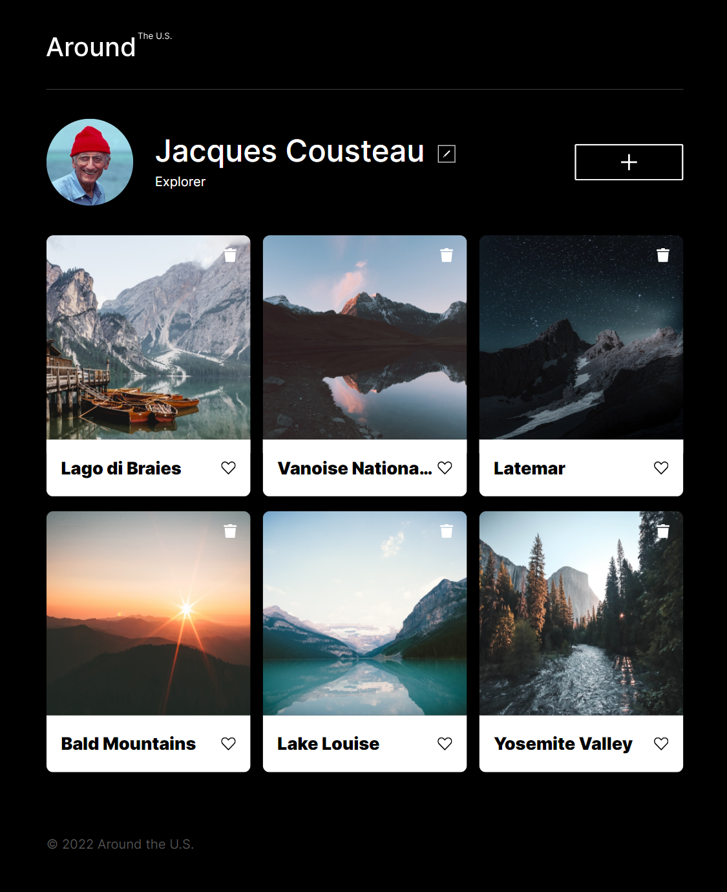
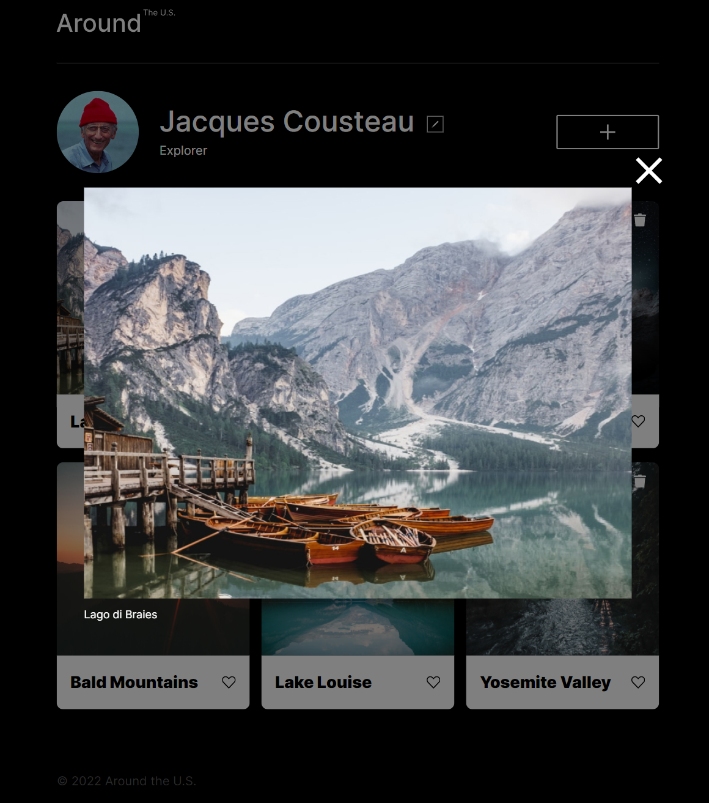
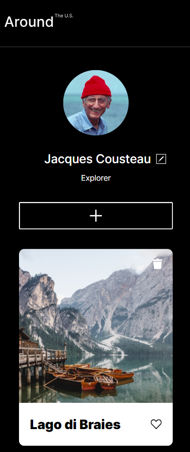

# Around The U.S., an Interactive Webpage

The Around the U.S. Interactive Webpage is the third project in the Software Engineering program at TripleTen. It was created using HTML, CSS, and JavaScript, based on a Figma design. The webpage was made for users to create a profile in which they can share photos, edit their profile, add and remove photos, and like the photos of other users. The project was conducted to demonstrate the ability to make a responsive webpage, optimizing the user's experience on the most popular screen sizes.

## Project Features

- HTML5
- Flexbox
- Grid Layout

**Project Link**

[Around the U.S.](https://saharam93.github.io/se_project_aroundtheus/)

**Project Images**

 
